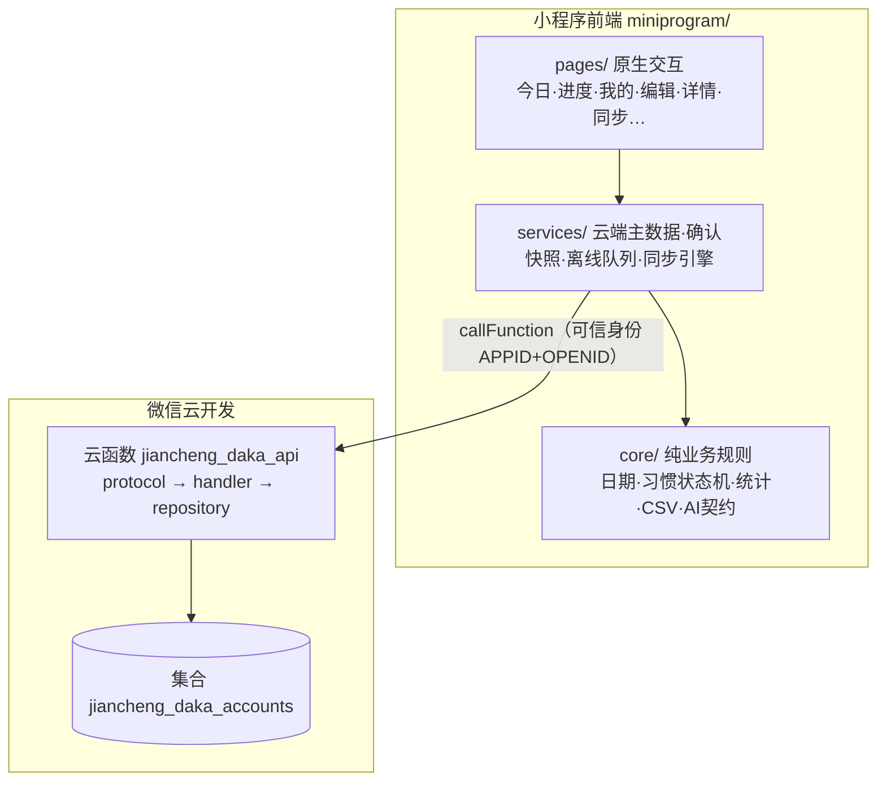

# 渐成习惯打卡 · 概设（概念设计）

> 配套：[详设](DESIGN-DETAIL.md) · [原型图](DESIGN-PROTOTYPE.md) · [数据库设计](DESIGN-DATABASE.md)
> 整理自源码与协议，2026-09-22。以代码为准，历史原型与营销口号仅作参考。

## 1. 产品定位

「渐成习惯打卡」是一款面向**个人用户**的轻量习惯养成工具，用**原生微信小程序**实现（非网页包装、非 Taro/uni-app）。核心价值是低门槛记录"今天做没做"：**创建习惯 → 每天打卡 → 看进度 → 留一句备注**。

刻意不做的部分：无积分/奖励/勋章、无三阶段长期计划、无内容流与营销页、无好友社交。目标收敛为"帮一个人坚持每天的一小步"。

## 2. 目标用户与场景

- 想养成某个小习惯、但缺记录动力的个人。
- 弱网/断网时也能看今天要做的事，恢复网络后自动补传。
- 换机后凭同一微信账号找回已同步记录。

## 3. 核心功能

| 模块 | 能力 |
| --- | --- |
| 今日 | 日期 + 添加入口、今日进度、待完成/已完成分组、打卡/撤销、"今天少做一点"、首页短句 |
| 习惯 | 创建（名称/目标/星期）、编辑/暂停/恢复/归档（次日生效）、详情备注与历史 |
| 进度 | 近 7/28 天统计、日历视图、按日明细、按习惯汇总 |
| 我的 | 习惯管理、首页短句开关、数据与隐私、使用帮助、微信内置反馈 |
| 计划助手 | 本机规则建议（当前非联网 AI），可预览并带入创建表单 |

## 4. 架构总览

分层职责：

| 层 | 职责 | 可测试性 |
| --- | --- | --- |
| `miniprogram/core` | 纯业务规则：日期、习惯状态机、统计、CSV、AI 结果校验 | Node 直接测试，无前端依赖 |
| `miniprogram/services` | 云端主数据、确认快照、持久离线队列、同步引擎、工作区 | 契约测试 |
| `miniprogram/pages` | 原生 WXML/WXSS/JS 交互 | 页面回归 |
| `server` | 协议白名单、可信身份校验、事务仓库、领域处理 | 服务端协议测试 |
| `cloudfunctions/jiancheng_daka_api` | 云函数入口 + 构建产物（只部署此目录） | 云包一致性 |

## 5. 数据权威模型

正式工作区**只有云端一种数据来源**。本机只承担两类职责：

- 用户不选择"本机/云模式"，不手动连接、断开或切换数据源。
- 首次启动先同意数据说明才联网；不同意则不联网，也不伪造可编辑空账户。
- 已有开发期本机数据不会自动上传/合并，只能从备份页单独导出。

## 6. 身份与安全

- 身份来自微信云函数的**可信上下文**（APPID + OPENID + SOURCE），客户端不得提交 userId/ownerId。
- 账户键 = `SHA256(APPID + ':' + OPENID)`，仅用于隔离与绑定，不是登录凭证、不是匿名化承诺。
- SOURCE 白名单仅 `wx_client` / `wx_devtools`；AppSecret 与模型密钥只放服务端环境变量，不进前端包。

## 7. 资源命名（B021）

| 用途 | 名称 |
| --- | --- |
| 业务云函数 | `jiancheng_daka_api` |
| 账户数据集合 | `jiancheng_daka_accounts` |
| 预留 AI 计划函数（未实现） | `jiancheng_daka_plan` |

命名前缀只用于辨识资源，**不是安全边界**；访问控制依赖可信身份与数据库权限。

## 8. 技术选型

- JavaScript + JSDoc / CommonJS，开发者工具直接导入；不引入 TypeScript 编译链、无第三方前端运行依赖。
- 云函数运行时目标 Node.js 16.13.2；本地测试/检查用 Node.js 20+。
- 前端无 npm 运行依赖，无需"构建 npm"。
