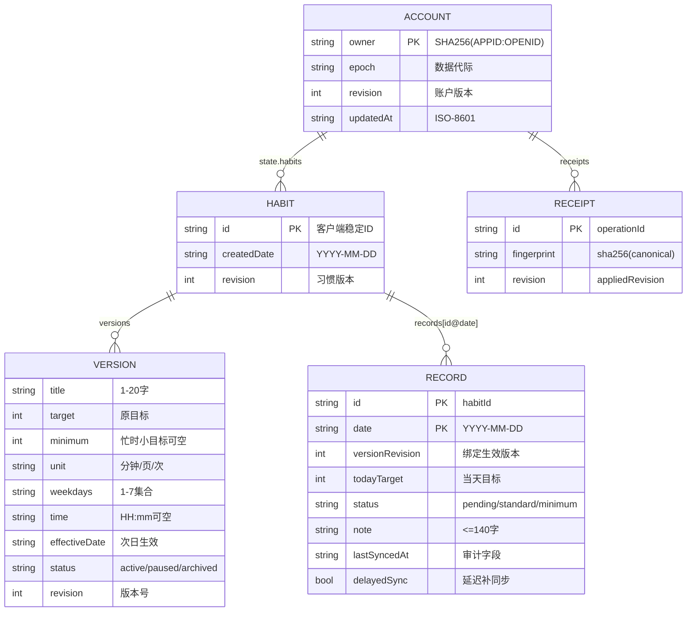

# 渐成习惯打卡 · 数据库设计

> 配套：[概设](DESIGN-CONCEPT.md) · [详设](DESIGN-DETAIL.md) · [原型图](DESIGN-PROTOTYPE.md)

## 1. 集合与文档

- 集合：`jiancheng_daka_accounts`（每账户一份文档）。
- 文档 ID：`owner = SHA256(APPID + ':' + OPENID)`。
- 客户端**不可直接读写**，仅云函数通过事务访问；缺失/权限错误/故障一律 fail-closed，绝不生成空替代账户。

## 2. ER 图



## 3. 账户文档结构

```js
account = {
  epoch: "<uuid>",                 // 数据代际，删除/重建后更换
  revision: <int>,                 // 账户版本，每次写入 +1
  state: {
    schemaVersion: 1,
    revision: <int>,
    habits: [ Habit ],             // 习惯数组（含版本链）
    records: { "<id>@<date>": Record },  // 打卡记录，键 = 习惯ID@日期
    settings: { hideQuote: false }
  },
  receipts: [ Receipt ],           // 操作回执（幂等），最多 256 条
  updatedAt: "<ISO-8601>"
}
```

## 4. 实体字段

**Habit**

```js
{ id, createdDate, revision, versions: [ Version ] }
```

**Version**

```js
{
  title, target, minimum, unit,
  weekdays: [1..7],       // 1=周一 … 7=周日，已排序去重
  time: "HH:mm" | "",     // 仅排序，不发提醒
  effectiveDate, status, revision
}
```

**Record**（键 `"<id>@<date>"`）

```js
{
  id, date, versionRevision, todayTarget,
  status: "pending" | "standard" | "minimum",
  note: "<≤140字>",
  // 服务端审计字段（不参与业务校验）：
  lastSyncedAt, delayedSync
}
```

**Receipt**

```js
{ id, fingerprint, revision }
```

## 5. 约束与校验

- `validateState` 保证：habits/records 键一致、versionRevision 匹配、状态与目标数值自洽（standard 要求 `todayTarget === version.target`，minimum 要求 `todayTarget < version.target`）。
- 写事务：账户状态与回执**同事务提交**（cloudbase-repository.js）；`saved` 未变化则不写回。
- 幂等：相同 operationId + 相同内容重试返回原回执；回执淘汰后旧请求仍受版本比较与 epoch 保护。
- 容量：习惯 ≤ 100、账户 ≤ 700 KiB、回执 ≤ 256、本机队列 ≤ 200。

## 6. 索引与权限

- 云函数按文档 ID 读写，单文档模型，无业务二级索引需求（正式环境需核对索引后再上线）。
- 权限规则：客户端不可直接读写集合；仅允许 `wx_client` / `wx_devtools` 来源的可信调用。
- 函数级开关：`HABIT_APP_ID` + `HABIT_MINIPROGRAM_ONLY=true` + `HABIT_API_ENABLED=true`。

## 7. 旧数据与迁移边界

- B021 起新部署用 `jiancheng_daka_` 前缀；旧测试云 `habitApi`、旧数据与旧缓存保留，**不自动迁移**。
- 已有开发期本机记录不会自动上传/合并，只能从备份页单独导出。
- 删除后云端保留最小元数据（账户键、递增版本、新 epoch、更新时间、删除回执）用于阻止旧设备回传。
