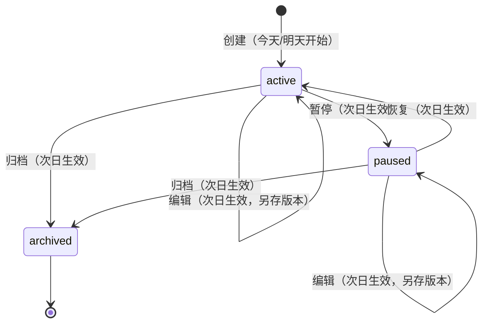
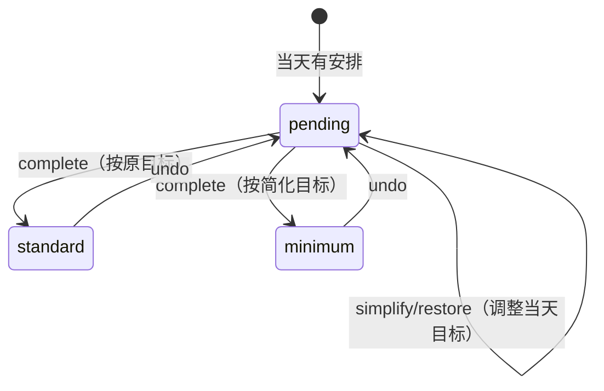
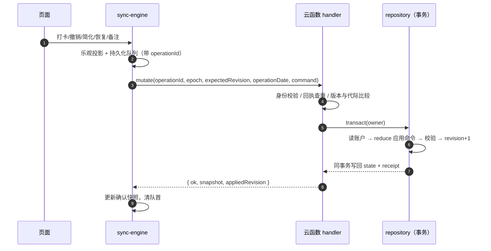

# 渐成习惯打卡 · 详设（详细设计）

> 配套：[概设](DESIGN-CONCEPT.md) · [原型图](DESIGN-PROTOTYPE.md) · [数据库设计](DESIGN-DATABASE.md)

## 1. 页面清单

`app.json` 注册 10 个页面，底部 TabBar 为「今日 / 进度 / 我的」。

| 页面 | 路径 | 职责 |
| --- | --- | --- |
| 今日 | pages/today | 待完成/已完成、打卡、撤销、少做一点、短句 |
| 进度 | pages/progress | 近7/28天统计、日历、明细与汇总 |
| 我的 | pages/mine | 习惯管理、偏好、数据与隐私、帮助/反馈 |
| 编辑 | pages/edit | 创建/编辑习惯（复用同一表单） |
| 详情 | pages/detail | 单习惯今日任务、备注、暂停/归档、28天历史 |
| 习惯管理 | pages/manage | 习惯列表管理 |
| 数据同步 | pages/sync | 数据说明、同步状态、重试、刷新、冲突处理 |
| 导出与找回 | pages/restore | 导出备份、找回 |
| 数据管理 | pages/data | 同步/CSV/导出/找回 + 双重确认删除 |
| 计划助手 | pages/assistant | 本机规则建议 / 预留 AI 细化 |

## 2. 习惯状态机

编辑/暂停/恢复/归档全部**次日生效**：新版本 `effectiveDate = 明天`，历史记录不变。

当天记录的状态机：

## 3. 命令（command）

| 类型 | 说明 | 在线要求 |
| --- | --- | --- |
| create / edit / status / cancelFuture | 计划管理 | 需在线确认 |
| complete / undo / simplify / restore / note | 当天记录 | 本地入队 → 后台顺序提交 |
| settings | 首页短句开关 | 在线 |

**当天记录**：完成、撤销、今天简化、恢复目标、备注先写本地队列并乐观投影到界面，再由单一后台任务顺序提交；网络失败保留原 operationId 与内容。

**计划管理**：先拉远端版本，再持久化带操作 ID 的请求并提交；有待同步或冲突时禁止叠加管理操作；超时后只能重试、不能重复提交同一意图；请求期间日期变化要求重新确认。

## 4. 同步协议

三种 action：`pull`（读取快照）、`mutate`（写入）、`purge`（删除）。

服务端处理顺序（handler.js）：

1. 身份校验：APPID 匹配 + SOURCE 白名单 + OPENID 格式。
2. 请求体 ≤ 4096 字节；字段白名单校验。
3. **回执检查**：同 operationId + 同指纹 → 直接返回原回执（幂等重放）；同 ID 换内容 → 拒绝。
4. **版本/代际比较**：epoch 或 expectedRevision 不匹配 → `EPOCH_CHANGED` / `CONFLICT`。
5. **日期门禁**：当天记录允许今天及之前 6 个自然日补同步（标记 `delayedSync`）；计划修改/删除必须当天。
6. 事务内 `reduce` 应用命令 → 校验 → 增量 revision → 写回账户 + 追加回执。

## 5. 可靠性机制

- 首次未同意不联网，不伪造可编辑空账户；读取失败显示"暂时无法读取记录"，不以空数据覆盖云端。
- 前台恢复先处理待同步队列，清空后才刷新；距上次网络尝试 < 30s 不重复轮询。
- 网络恢复：唯一 `onNetworkStatusChange` 监听器 + 300ms 去抖 + 恢复间隔 ≥ 1.5s；无周期性重试循环。
- 多设备冲突：停止自动上传、保留本机意图，用户明确 `DISCARD_PENDING` 后才替换（先存恢复副本）。
- 删除防复活：删除后云端保留新 epoch/版本/最小删除回执，旧设备重连靠数据代际拒绝旧写入。
- 备注草稿：会话内暂存、不写盘不联网、按账户/代际/习惯/日期隔离。

## 6. 统计口径

近 7/28 天（`summary`）：以"完成次数 / 计划次数"为主、比例其次；日历单元 tone 四类：`rest`（无安排）/ `pending`（未完成）/ `partial`（部分）/ `full`（全部完成）。"休息日不算漏做"。

## 7. 保护阈值

| 限制 | 值 |
| --- | --- |
| 同时活动习惯 | 5 个 |
| 保留习惯总数 | 100 个 |
| 单账户序列化大小 | 700 KiB |
| 最近操作回执 | 256 个 |
| 本机待同步操作 | 200 个 |
| 单次请求 JSON | 4096 字节 |

这些是应用级阈值，不代表云平台配额；服务端每用户/全局限流与预算熔断尚未实现（上线前待补）。
