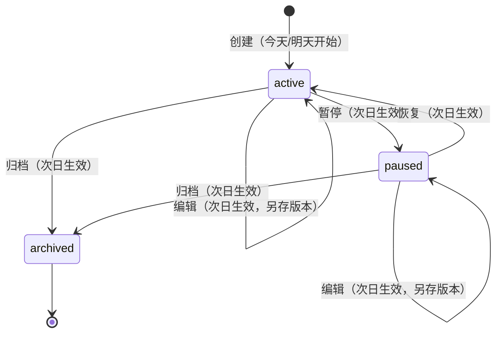
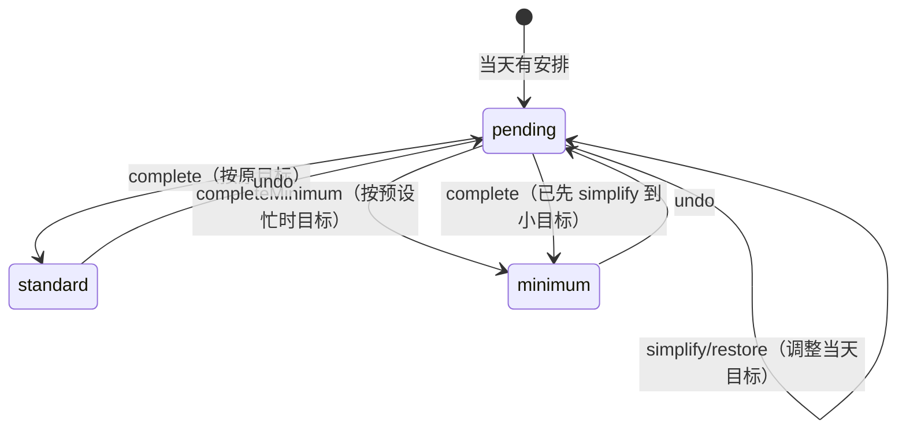
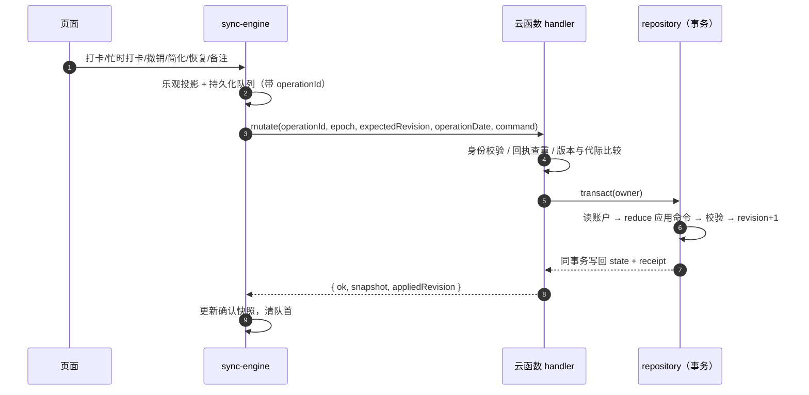

# 渐成习惯打卡 · 详设（详细设计）

> 配套：[概设](DESIGN-CONCEPT.md) · [原型图](DESIGN-PROTOTYPE.md) · [数据库设计](DESIGN-DATABASE.md) · [云函数设计](DESIGN-CLOUD.md)
> 2026-09-28 复核。命令、动作与门禁以源码为准。

## 1. 页面清单

`app.json` 注册 **14 个页面**，底部 TabBar 为「今日 / 进度 / 我的」。

| 页面 | 路径 | 职责 | 入口/开关 |
| --- | --- | --- | --- |
| 今日 | pages/today | 待做/已做、逐项打卡、原位撤销、明天安排、少做一点、回归提示、短句 | Tab |
| 进度 | pages/progress | 近 7/28 天统计、日历、明细与汇总 | Tab |
| 我的 | pages/mine | 习惯管理、偏好、数据与隐私、分享/提醒入口、帮助/反馈 | Tab |
| 编辑 | pages/edit | 创建/编辑习惯（复用同一表单，忙时小目标在主表单） | 今日/详情/管理 |
| 详情 | pages/detail | 单习惯今日任务、备注、暂停/归档、28 天历史 | 今日/进度/管理 |
| 习惯管理 | pages/manage | 习惯列表管理 | 我的 |
| 数据同步 | pages/sync | 数据说明、同步状态、重试、刷新、冲突处理 | 我的/数据 |
| 导出与找回 | pages/restore | 导出备份、找回 | 数据 |
| 数据管理 | pages/data | 同步/CSV/导出/找回 + 双重确认删除 | 我的 |
| 计划助手 | pages/assistant | 本机规则建议 / AI 增强（受开关） | 今日 |
| 分享创建 | pages/share-create | 选类型 → 预览公开字段 → 创建快照 | 分享列表 |
| 我的分享 | pages/share-list | 本人 `invite/plan/weekly` 列表、回看/撤回/删除 | 我的（`sharingEnabled`） |
| 分享查看 | pages/share-view | 好友只读打开公开快照（可免登录） | 分享链接/卡片 |
| 提醒 | pages/reminder | 选时段、预览下一次、主动授权、取消 | 我的（`remindersEnabled`） |

「我的」页在开关为关时不渲染「我的分享」「下一次提醒」入口（`services/features-client` 的 `status()` 决定）；「分享小程序」用 `open-type="share"` 常驻。

## 2. 习惯状态机

编辑/暂停/恢复/归档全部**次日生效**：新版本 `effectiveDate = 明天`，历史记录不变。

当天记录的状态机：

`completeMinimum`（「按忙时目标打卡」）是一次**原子**写入：仅当版本有合法 `minimum` 且今天未完成时可用，同一步置 `todayTarget=minimum`、`status=minimum`；服务端从当前生效计划读取 `minimum`，不接受客户端提供任意目标。它与 `simplify`（只调小目标、状态仍 `pending`）+ `complete` 是两条不同路径。

## 3. 命令（command）

服务端命令白名单（`lib/protocol.js` 的 `COMMAND_FIELDS`）：

| 类型 | 字段 | 说明 | 在线要求 |
| --- | --- | --- | --- |
| create | id, startDate, plan | 新建习惯 | 需在线确认 |
| edit | id, baseRevision, plan | 长期编辑（次日生效） | 需在线确认 |
| status | id, baseRevision, status | 暂停/恢复/归档 | 需在线确认 |
| cancelFuture | id, baseRevision | 撤销待生效版本 | 需在线确认 |
| complete | id, date | 按当天目标完成 | 本地入队 → 后台顺序提交 |
| completeMinimum | id, date | 按预设忙时目标原子完成 | 本地入队 → 后台顺序提交 |
| undo | id, date | 撤销当天记录 | 本地入队 → 后台顺序提交 |
| simplify | id, date, target | 仅调小今天目标 | 本地入队 → 后台顺序提交 |
| restore | id, date | 恢复今天原目标 | 本地入队 → 后台顺序提交 |
| note | id, date, note | 当天备注（≤280 字符） | 本地入队 → 后台顺序提交 |
| settings | hideQuote | 首页短句开关 | 在线 |

当天记录类型集合 `RECORD_TYPES = ['complete','completeMinimum','undo','simplify','restore','note']`。

**当天记录**：完成、忙时完成、撤销、今天简化、恢复目标、备注先写本地队列并乐观投影到界面，再由单一后台任务顺序提交；网络失败保留原 operationId 与内容。

**计划管理**：先拉远端版本，再持久化带操作 ID 的请求并提交；有待同步或冲突时禁止叠加管理操作；超时后只能重试、不能重复提交同一意图；请求期间日期变化要求重新确认。

## 4. 同步协议

三种 action：`pull`（读取快照）、`mutate`（写入）、`purge`（删除）。

服务端处理顺序（handler.js）：

1. 身份校验：APPID 匹配 + SOURCE 白名单 + OPENID 格式。
2. 请求体 ≤ 4096 字节；字段白名单校验。
3. **回执检查**：同 operationId + 同指纹 → 直接返回原回执（幂等重放）；同 ID 换内容 → 拒绝。
4. **版本/代际比较**：epoch 或 expectedRevision 不匹配 → `EPOCH_CHANGED` / `CONFLICT`。
5. **日期门禁**：当天记录允许今天及之前 6 个自然日补同步（标记 `delayedSync`）；计划修改/删除必须当天。
6. 事务内 `reduce` 应用命令 → 校验 → 增量 revision → 写回账户 + 追加回执。

## 5. 可靠性机制

- 首次未同意不联网，不伪造可编辑空账户；读取失败显示"暂时无法读取记录"，不以空数据覆盖云端。
- 前台恢复先处理待同步队列，清空后才刷新；距上次网络尝试 < 30s 不重复轮询。
- 网络恢复：唯一 `onNetworkStatusChange` 监听器 + 300ms 去抖 + 恢复间隔 ≥ 1.5s；无周期性重试循环。
- 多设备冲突：停止自动上传、保留本机意图，用户明确 `DISCARD_PENDING` 后才替换（先存恢复副本）。
- 删除防复活：删除后云端保留新 epoch/版本/最小删除回执，旧设备重连靠数据代际拒绝旧写入。
- 备注草稿：会话内暂存、不写盘不联网、按账户/代际/习惯/日期隔离。
- 回归提示（gentle-return）：仅当今天有未完成任务、且该习惯最近 ≥2 个已结束计划日连续未记录时显示；休息日跳过；待同步/冲突/不可读时隐藏；不补签、不改历史、不新增权威字段。
- 功能网关：偏好/分享/提醒/AI 的客户端调用全部经 `services/features-client` 与 `services/plan-assistant` 的开关判定，关闭时"我的"入口不渲染、页面不发起调用。

## 6. 功能网关与云函数路由

客户端按用途路由到不同云函数（名称来自 `config/cloud-resources.js`）；每个函数有独立启用门禁，未开启即返回 `NOT_ENABLED`。完整动作、字段与门禁见[云函数设计](DESIGN-CLOUD.md)。

| 用途 | 云函数 | 客户端开关 | 服务端门禁（关键项） |
| --- | --- | --- | --- |
| 主数据同步 | `jiancheng_daka_api` | `cloud.js` | `HABIT_APP_ID` + `HABIT_MINIPROGRAM_ONLY` + `HABIT_API_ENABLED` |
| 偏好/分享/提醒（私有） | `jiancheng_daka_features` | `features.js` / `reminders.js` | `HABIT_FEATURES_ENABLED` 等 6 项 |
| 公开分享只读 | `jiancheng_daka_public_share` | `features.js#publicShares` | `HABIT_PUBLIC_SHARES_ENABLED` 等 |
| AI 计划 | `jiancheng_daka_plan` | `ai.js` | `HABIT_AI_*` 等 8 项 + 供应商 `deepseek` |
| 提醒定时催发 | `jiancheng_daka_reminder_tick` | 无（平台定时触发） | 提醒门禁 + 定时器验证 |

`config/cloud.js` 当前指向**旧测试环境** `habitApi`；`config/cloud.product.js`（共享正式环境）`enabled:false`。旧 `habitApi` 未升级 `completeMinimum`，故「按忙时目标打卡」快捷入口在兼容 API 部署并显式开启前保持隐藏。

## 7. 分享与提醒（已实现，默认关闭）

- **分享**：三类公开快照 `invite` / `plan` / `weekly`；服务端从本人云账户生成白名单字段（不接受客户端上传的完成数、习惯名、备注、OpenID）。服务端预览 → 创建 → 分享详情页 → 微信好友/朋友圈手动转发；`shareId` 由服务端 `SHA256(owner:epoch:requestId)` 派生，公开有效期 90 天。公开入口 fail-closed：账户不存在、epoch 不同、撤回、到期、读库异常都返回统一"分享不可用"。
- **提醒**：3 个固定时段（北京时间 08:00 / 12:30 / 20:30），用户主动授权后按服务端北京时间算出"今天未来时段或下一个计划日"，同一 owner 同日最多一条待发聚合记录；定时函数事务认领 → 调平台接口一次 → 写结果，结果不明标 `unknown` 不重发。平台接受请求 ≠ 送达，不写"对方已收到"。
- **AI 计划**：仅在本机规则建议之外提供增强；受信身份 + 账户代际 + 本次明确同意门控；模型只在受限动作目录内选 `actionKey/reasonKey/target/minimum`，界面文案由审核目录构造；按次/日/月预留预算与请求幂等，失败不重试。

## 8. 统计口径

近 7/28 天（`summary`）：以"完成次数 / 计划次数"为主、比例其次；日历单元 tone 四类：`rest`（无安排）/ `pending`（未完成）/ `partial`（部分）/ `full`（全部完成）。"休息日不算漏做"（回归提示同样跳过休息日）。

## 9. 保护阈值

| 限制 | 值 |
| --- | --- |
| 同时活动习惯 | 5 个 |
| 保留习惯总数 | 100 个 |
| 单账户序列化大小 | 700 KiB |
| 最近操作回执 | 256 个 |
| 本机待同步操作 | 200 个 |
| 单次请求 JSON（主 API） | 4096 字节 |
| 单次请求 JSON（提醒动作） | 2048 字节 |
| 有效分享 / 分享总历史 / 每日新建 | 50 / 200 / 10 |
| 偏好 `shareIndex` / `dailyCreates` / 回执 | 200 / 10 / 64 |
| 提醒 `generation` 上限 | 8 |

这些是应用级阈值，不代表云平台配额。每用户/全局限流与 AI 预算已在代码实现（`jiancheng_daka_limits`、`jiancheng_daka_ai_budget`），但平台配额、账单告警与停服验证仍是独立的下线验收门禁。

## 10. 待验收（代码完成 ≠ 可用）

| 项 | 状态 | 证据缺口 |
| --- | --- | --- |
| 共享正式云身份/权限 | 阻塞 | `Cloud.init()` 实测 403，授权存在但运行时鉴权未通过 |
| 主 API 兼容 `completeMinimum` | 待办 | 旧 `habitApi` 未升级，快捷入口隐藏 |
| 分享真机 | 待办 | 好友/朋友圈打开、单页模式、撤回后旧链接、双用户隔离 |
| 提醒真实送达 | 待办 | 模板资格、真实授权、定时器、时区、TTL、账单上限 |
| AI 真实调用 | 待办 | 供应商/模型/价格、隐私条款、有效性；无收益则不启用 |
| 真机与发布 | 待办 | Android/iOS 全流程、大字号、窄屏、弱网、反馈接收、审核资料 |

完整清单见 [剩余交付跟踪](REMAINING-DELIVERY-20260927.md)。
