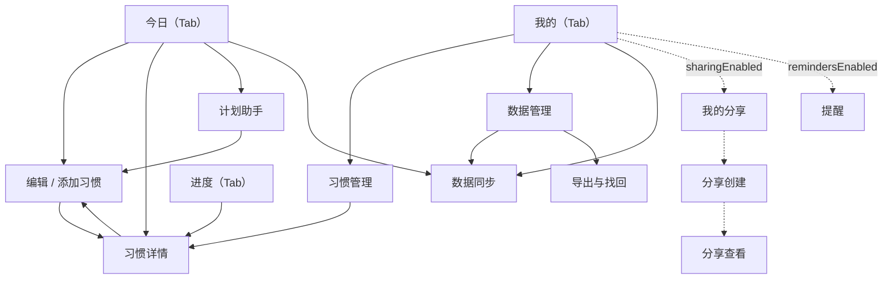

# 渐成习惯打卡 · 原型图

> 配套：[概设](DESIGN-CONCEPT.md) · [详设](DESIGN-DETAIL.md) · [数据库设计](DESIGN-DATABASE.md) · [云函数设计](DESIGN-CLOUD.md)
> 截图来自微信开发者工具原生模拟器。今日/创建/我的/计划助手为 2026-09-27 版本（`docs/evidence-20260927/`）；其余页面沿用 2026-09-21 B020 版本（`docs/evidence-b020/`）。

## 1. 视觉规范

| 项 | 值 |
| --- | --- |
| 背景 | `#ffffff` |
| 主文字 | `#183b31` |
| 主操作（绿） | `#245c44` |
| 轻反馈（浅绿） | `#ddf3a4` |
| 分隔线 | `#e8ede7` |
| 次要文字 | `#65756c` |
| 字体 | 系统中文无衬线；标题 22px/700、区块 18px/600、正文 16px、说明 14px |
| 排版 | 左右 20px 边距，开放列表 + 细分隔线，无阴影卡片堆叠 |
| 星期 | 固定七列、间距 4px、按钮 48px 高 |
| 主按钮 | 至少 48px 高，跟随页面滚动 |
| 导航 | 原生顶部导航 + 底部「今日/进度/我的」三 Tab；详情用原生返回栈 |

## 2. 页面导航

`app.json` 注册 14 个页面。主流程与新增（默认关闭）入口如下，虚线为受开关控制的入口：

## 3. 页面截图

### 3.1 今日（首页，含回归提示与双档目标）

### 3.2 添加习惯（忙时小目标已在主表单）

### 3.3 进度

### 3.4 习惯详情（含更多操作）

### 3.5 我的

> 开关全关时「我的分享」「下一次提醒」入口不渲染；截图即当前默认状态。

### 3.6 数据管理

### 3.7 导出与找回

### 3.8 计划助手（入口 / 建议预览）

### 3.9 数据同步

### 3.10 习惯管理 / 编辑习惯

### 3.11 分享与提醒（新页面，默认关闭，尚未取证）

以下页面代码已完成但默认关闭，**尚无**正式截图；待开发者工具可用时补取：

| 页面 | 路径 | 截图状态 |
| --- | --- | --- |
| 分享创建 | pages/share-create | 待截取 |
| 我的分享 | pages/share-list | 待截取 |
| 分享查看（公开只读） | pages/share-view | 待截取 |
| 提醒 | pages/reminder | 待截取 |

## 4. 说明

- 以上为原生模拟器截图，非设计稿；视觉沿用既有方案而非像素复刻旧原型。
- 旧原型中的大口号、积分、三阶段计划已按评审移除，当前以任务、计数、表单为主要层级。
- 更早版本（B019 / 363px 发布版 / 390px）截图在 `docs/evidence-b019-20260920/` 与 `docs/evidence-*.png`，仅供历史追溯。
- 进度/详情/管理/数据/导出找回/同步 仍为 2026-09-21 B020 版本，其中详情页双档目标文案在 2026-09-27 批次有更新，重截前以本页为准的说明仅作参考。

## 5. 截图取证状态

- 2026-09-27 通过开发者工具原生模拟器补取了今日、创建、我的、计划助手（含建议预览）5 张，已归档 `docs/evidence-20260927/`。
- 2026-09-28 复核尝试重新截取其余页面：本机仅有开发者工具 User Data（无程序本体/CLI），上次使用的 `wechatide` MCP 在本会话未挂载，自动重截**未执行**，未伪造任何截图。
- 待补：进度、详情、管理、数据、导出找回、同步，以及 §3.11 的四个新页面。
