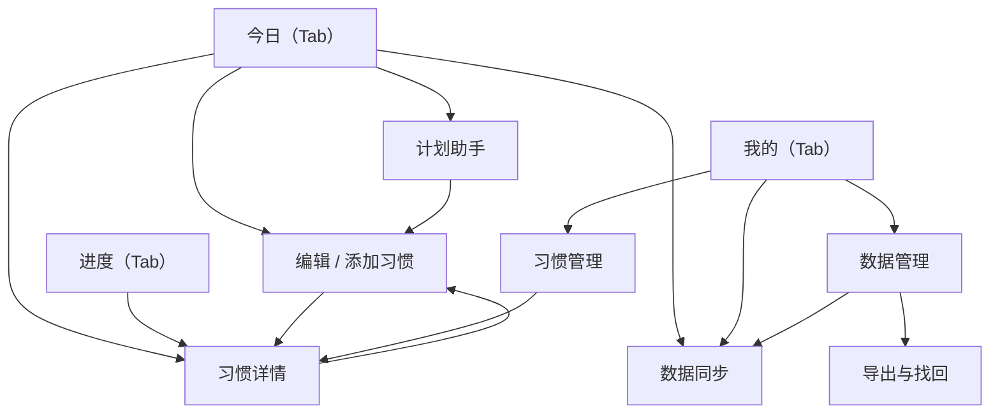

# 渐成习惯打卡 · 原型图

> 配套：[概设](DESIGN-CONCEPT.md) · [详设](DESIGN-DETAIL.md) · [数据库设计](DESIGN-DATABASE.md)
> 本页截图来自微信开发者工具原生模拟器（363×785），为 B020 评审整改后版本（2026-09-21）。原始文件在 `docs/evidence-b020/`。

## 1. 视觉规范

| 项 | 值 |
| --- | --- |
| 背景 | `#ffffff` |
| 主文字 | `#183b31` |
| 主操作（绿） | `#245c44` |
| 轻反馈（浅绿） | `#ddf3a4` |
| 分隔线 | `#e8ede7` |
| 次要文字 | `#65756c` |
| 字体 | 系统中文无衬线；标题 22px/700、区块 18px/600、正文 16px、说明 14px |
| 排版 | 左右 20px 边距，开放列表 + 细分隔线，无阴影卡片堆叠 |
| 星期 | 固定七列、间距 4px、按钮 48px 高 |
| 主按钮 | 至少 48px 高，跟随页面滚动 |
| 导航 | 原生顶部导航 + 底部「今日/进度/我的」三 Tab；详情用原生返回栈 |

## 2. 页面导航

## 3. 页面截图

### 3.1 今日（首页）

### 3.2 添加习惯（默认 / 更多设置展开）

### 3.3 进度

### 3.4 习惯详情（含更多操作）

### 3.5 我的

### 3.6 数据管理

### 3.7 导出与找回

### 3.8 计划助手（建议预览 / 带入表单）

### 3.9 数据同步

### 3.10 习惯管理 / 编辑习惯

## 4. 说明

- 以上为实机模拟器截图，非设计稿；视觉沿用既有方案而非像素复刻旧原型。
- 旧原型中的大口号、积分、三阶段计划已按评审移除，当前以任务、计数、表单为主要层级。
- 更早版本（B019 / 363px 发布版 / 390px）截图在 `docs/evidence-b019-20260920/` 与 `docs/evidence-*.png`，仅供历史追溯。
