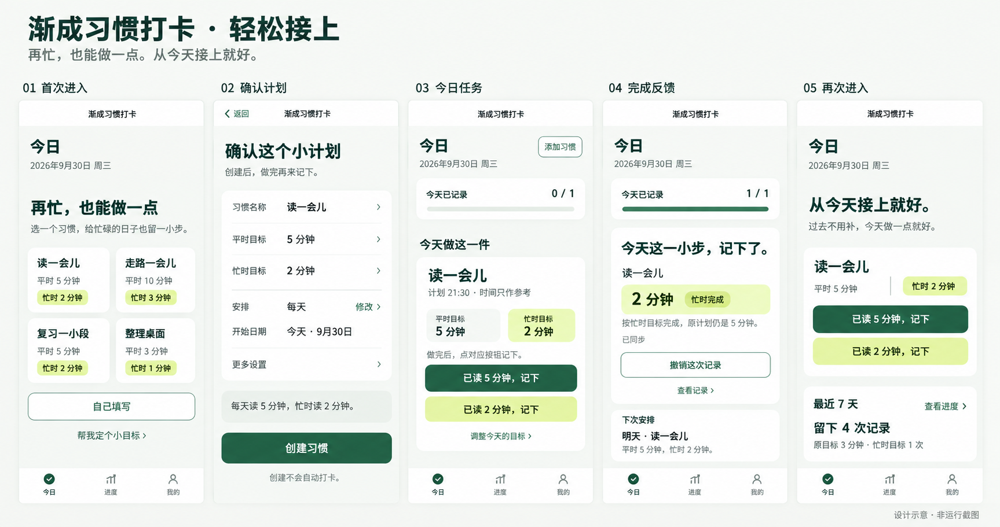

# 渐成习惯打卡：完整旅程审查与优化设计

日期：2026-09-30。对象：`dev` 当前工作区，基线提交 `a352b0c` 加已有未提交改动。开始时已 fetch，HEAD 与 origin/dev 无差异。本报告及配套图片是本轮新增设计交付，原有审查稿和实现文件保持原样。

实施交接补充：交给其他AI时先读[具体执行规格](AI-OPTIMIZATION-HANDOFF-20260930.md)及[50条验收用例](AI-OPTIMIZATION-ACCEPTANCE-20260930.md)。后续确认的按钮措辞、双主题协议、回执核对与完成保留细则以交接规格为准；本报告保留原始观察与设计推理，不作为另一套并行实现要求。

配色修订：按后续反馈，方案调整为可切换的“薄雾绿 / 暖纸白”两套浅色主题，减少大面积墨绿与青柠。最新token、视觉稿及切换规则见[双主题修订](UX-THEMES-20260930.md)。本报告中的第一版五屏仍用于流程参考。

交付：本报告、[推荐方向五屏视觉稿](designs/2026-09-30-journey-review/direction-a-five-screens.png)、[备选方向视觉稿](designs/2026-09-30-journey-review/direction-b-daily-page.png)、[本轮截图与证据索引](audits/2026-09-30-journey-review/EVIDENCE.md)。本轮选择静态视觉稿交付形式；未制作新的可点击原型。

证据标识：**O 实际观察**＝本轮实际页面/操作；**F 受控渲染**＝本轮将合成展示数据放入真实小程序页面内存后截图，仅证明界面；**C 源码核对**＝辅助理解实现，不能证明运行成功；**J 设计判断**＝专家判断；**H 待测假设**＝须目标用户验证。截图均为当前运行版本，未借用旧截图。没有真实创建、打卡、撤销、云端写入或订阅发送实验。

## 1. 产品体验判断

### 用户、任务与五个目标

**H：主要用户**是想养成阅读、学习、散步等日常习惯，但时间不稳定、容易因一次中断而放弃的上班族与学生。当前产品适合个人、轻量、自我记录；不假设它承担专业训练指导、医疗建议、团队考勤或严格计时。

使用情境：睡前、通勤间隙、完成一件小事后顺手打开微信；常用一只手，可能中途退出。最重要的任务是“给自己定一个做得到的计划，做完后快速记下，下一次还能继续”。

**首次实际价值**发生在用户选出可执行的目标、在生活中做了这件事，并确认记录正确之后。创建成功只是准备完成；不能把创建数量或误点打卡当成产品价值。

| 目标 | 本产品的重要程度 | 本次设计重点 |
| --- | --- | --- |
| 好用 | 最高，影响每次使用 | 做完后的记录明确、可点、可恢复；失败不丢掉操作方向 |
| 会用 | 最高，影响第一次价值 | 模板确认够短；用户能区分创建、实际行动、记下完成 |
| 愿意回来 | 高 | 每次回来知道今天做什么；中断后无需补债 |
| 想用 | 高 | 第一屏说明忙时也能做小；视觉可信、字能读清 |
| 愿意推荐 | 次于前三项 | 一句话说清“双档目标”；分享由用户主动发起 |

### 已有优势，应保留

1. **O01：首次价值表达已成立。**“再忙，也能做一点”与四个带平时/忙时目标的模板共同解释用途；首屏主次比旧稿描述更清楚。此次不再将“没有价值表达、没有双档模板”列为问题。
2. **O01–O06：信息架构稳定。**今日、进度、我的三个 Tab 容易理解；模板、自己填写、助手处于不同视觉层级；不需要新增导航。
3. **O02–O03：目标、忙时目标、星期和生效日期可核对。**选模板已经预填；“不会自动计时或累计”“按星期、不含调休”等重要限制有说明。
4. **O04：无数据时提供创建入口。**没有用全零图表和排行榜填满空页面。
5. **F08：日常卡片保留了两个目标和忙时快捷记录。**忙时能力已在当前界面存在，不再建议重新发明一条忙时路径。
6. **C：有原位短时撤销、已完成分组中的撤销、回归提示、次日安排。**这些设计方向正确；本轮尚未验证真实保存与撤销闭环。
7. **O：本轮打开后未出现登录/头像昵称授权墙。**这不代表新微信账号首次进入已完成验证。

### 核心障碍与最先改变的三件事

当前最明显的问题已从“缺价值表达”转为**确认成本、动作可理解性和异常恢复的一致性**。

1. **所有读写失败都有原地下一步。**进度失败态实测渲染只有“连接后重试”文案，没有重试控件；先修通恢复路径。
2. **模板创建变成一屏确认。**已经选好模板，仍需越过完整表单、七个星期按钮和说明，到第二屏寻找“创建习惯”。
3. **把每日记录做得可读、可点、可撤销。**明确按哪个目标记下；忙时按钮增至至少44px；提高辅助文字对比度；成功结果有持久入口。

### 功能去留与信息架构

| 功能 | 对核心任务的作用 | 处理 |
| --- | --- | --- |
| 今日任务、双档目标、撤销 | 直接完成核心任务 | 保留，优先改细节 |
| 模板与自定义 | 支持不同清晰程度的需求 | 保留，模板走短确认，自定义走完整编辑 |
| 进度与按习惯回看 | 帮用户理解近期节奏 | 保留，先事实后建议，弱化百分比 |
| 计划助手 | 帮尚未想清楚的人起步 | 保留一个辅助入口；已有任务时从今日移至添加习惯页 |
| 首页短句 | 情绪支持，非任务依赖 | 保留已有关闭能力；位于任务之后，不占主要首屏 |
| 分享、提醒 | 可选的传播与召回 | 保留现有入口策略；不加入首次创建或打卡完成必经链路 |
| 云端状态、数据清除 | 可信与支持能力 | 正常时留在我的；异常时给上下文入口；清除与恢复分开 |

## 2. 按优先级排序的问题与建议

优先级先看是否阻断任务，再看接触频率、证据强度和成本；频率是按流程估计，尚无线上发生率。成本 S＝少数页面/组件，M＝跨页面与状态，L＝涉及新服务/协议。原旅程优化主要复用已有业务；后续新增的跨会话主题保存涉及云偏好协议，单独按L级安排。

| 排名 | 问题 | 影响/频率 | 证据可信度 | 成本 | 建议顺序 |
| --- | --- | --- | --- | --- | --- |
| 1 | 非首页失败态没有直接重试 | 阻断恢复；异常条件发生率未知 | F09/F10 + C，高于纯推测 | S–M | P0 |
| 2 | 12px辅助文字偏淡，忙时按钮仅38px | 高频阅读和点击 | O02 + F08实测 + 色值计算 | S | P1，优先低成本修复 |
| 3 | 模板创建主按钮在第二屏 | 首次任务，用户都要经过 | O02/O03；流失影响为H | M | P1 |
| 4 | “打卡”与目标数值分离，忙时标签和按钮重复 | 每日记录，核心语义 | F08；是否误解为H | S–M | P1，先任务测试 |
| 5 | 完成后的原位反馈只有短时窗口 | 每次完成/误触 | C；真实可发现性为H | M | P1，与记录改动一起验证 |
| 6 | 助手预览说明密集，已有任务页仍给助手高位入口 | 低频创建与高频首页 | O07/F08 | S | P2 |
| 7 | 回归提示与任务动作重复；统计建议可能显得武断 | 中断后、周回看 | C + J/H | M | P2，控制范围 |
| 8 | 内页直达、分享失效、键盘和大字号缺运行证据 | 条件性入口/设备适配 | C/H，不作为已证实故障 | M | 验收门槛，发现阻断则升P0 |

### P0-01：错误提示给出可执行的恢复动作

- **页面/场景**：进度、创建、详情、我的、管理、数据与隐私读取失败。今日作为统一样式来源。
- **依据**：F10进度页显示“网络暂时不可用，请连接后重试”，没有按钮；F09今日同样状态有“重新读取”。C核对进度/创建/详情等分支确认不一致。故障状态由展示数据注入，未真实断网。
- **影响**：用户需要猜测切 Tab、返回、重开是否有效；“重试”文案与可操作区域不对应。
- **设计**：统一标题“暂时读不到记录”；说明“检查网络后，点下面重新读取。”；主按钮“重新读取”；内页次按钮“回到今日”。重试时原位置显示“读取中…”，禁连点；成功回原页面，失败仍保留按钮。
- **特殊情况**：提交超时须显示“还未确认是否记下，正在核对”，复用现有会话以同一operationId及冻结payload幂等恢复；不能重新dispatch一条新命令。“核对”不要求新增操作查询接口。已明确未提交才显示“未记下 · 重试”，不写“数据没有丢失”这样的未经核对保证。
- **收益/代价**：减少死路；需要统一读状态组件和超时/冲突文案，成本S–M，不放宽云端约束。
- **验证**：T6；每个页面断网、超时、拒绝、恢复网络分别走通；无重复记录、无离线队列。

### P1-02：辅助文字与触控区先达标

- **页面/场景**：创建表单说明、进度脚注、忙时目标按钮。
- **依据**：O02辅助说明明显小而浅；C为12px `#7C8B81`；与页面底色`#F6F8F5`按sRGB计算对比度约3.35:1。F08自动化读取忙时按钮实际尺寸166.48×38px。属于真实渲染尺寸，不是图片估算。
- **影响**：忙碌情境、弱视、大字号用户更易漏读规则或误触。误触比例尚未测量。
- **设计**：说明默认14px/1.5，按最新主题使用`#647067`（薄雾绿）或`#70695F`（暖纸白）；非关键信息最小12px；忙时动作最小44×44px，推荐48px高，两个目标按钮至少8px间隔。重要规则不只放占位符。
- **修改后**：“做完后再记下，不会自动计时。”与按钮同一区域；错误文字紧邻字段且保留输入。
- **收益/代价**：阅读和触达更稳；页面可能变高，需同步折叠不常用字段，成本S。
- **验证**：T2/T3及320px、大字号、单手测试；文字对比度至少4.5:1，控件边界/关键非文字图形至少3:1，实测而非仅看截图。

### P1-03：模板路径改为一屏计划确认

- **页面/场景**：首次进入点“读一会儿”等现成模板。
- **依据**：O02只有表单上半部分；O03滚动后才看到“首次安排”和“创建习惯”。星期七键占两行，全部预选每天。预填并未免除逐项审阅的视觉负担。
- **影响**：新用户不确定还要填写什么，关键提交动作不在首屏。是否导致放弃为H。
- **设计**：模板打开“确认这个小计划”；名称、平时/忙时目标可直接编辑；频次默认摘要“每天 · 修改”，仅点击修改展开星期；开始时间展示“今天 · 9月30日”；计划时间放更多设置。底部固定“创建习惯”，上方一句“每天读5分钟，忙时读2分钟”。
- **修改后流程**：选模板 → 看摘要（可改）→ 创建 → 今日出现计划 → 现实中完成 → 记下。提交不自动打卡。非当天安排显示确切首次日期，不暗示今天必须做。
- **保留能力**：自定义仍有名称、数量、单位、频次和开始日期；高级用户不丢选项。修改目标须重新校验忙时值小于平时值；更换单位同步更新说明。
- **收益/代价**：少一次默认滚动，减少默认暴露的选择；两个入口共用表单状态，避免维护两份校验，成本M。
- **验证**：T1/T2；创建耗时先测现状，拟定60秒内完成模板创建；不能以减少点击数掩盖选错日期。

### P1-04：记录动作直接说清“按哪个目标记下”

- **页面/场景**：今日待做任务；尤其是已完成忙时目标的用户。
- **依据**：F08右侧“打卡”与下面“按忙时目标打卡·2分钟”一强一弱；目标行又有“忙时2分钟”标签，内容重复。C显示这两个动作都直接记录，并非开启计时。
- **影响**：J认为“打卡”需要用户再次对照目标；H需要验证用户是否误把忙时按钮理解为仅选择一个较小目标。
- **设计**：标题后展示两个目标；按钮明确“已读5分钟，记下”“已读2分钟，记下”。任意自定义名称使用通用模板“已完成5分钟，记下”，不自动猜动词。“调整今天的目标”保持在详情中的次要动作，不与记录并列抢权重。
- **修改后流程**：完成现实任务 → 点匹配按钮 → 该任务双按钮同时进入提交中 → 云端确认 → 记录结果；无额外确认弹窗。忙时保存不修改长期平时目标。
- **多任务取舍**：视觉稿为一项习惯的展开状态。已有2项以上时采用紧凑列表：名称+目标一行，下一行两个48px按钮；移除时间解释与重复教育句，已完成分组置后。≤359px时两按钮竖排，≥360px可并排，文本自然换行且最小44px，不牺牲字号换密度。
- **收益/代价**：语义更明确；按钮更长、单卡更高，需要多习惯密度验证。成本S–M。若T3证明现有“打卡”已足够清楚，保留其熟悉措辞，只加“按5分钟”并修触控区。
- **验证**：T3；未做任务不得误以为点击会替自己完成；按忙时后应能说清记录是2分钟、平时仍是5分钟。

### P1-05：完成结果留下可回看的证据

- **页面/场景**：提交成功、误触撤销、稍后返回。
- **依据**：C `today/index.js`原位撤销期6000ms，之后已完成组默认折叠；C模板存在长期撤销，当前并非“不能撤销”。本轮没有真实完成动作证据。
- **影响**：H：慢读用户可能错过原位反馈，误以为任务消失；需要测“6秒后撤销”的发现率。
- **设计**：近期完成的行在本次页面停留期间保持原位置、显示目标与“忙时完成/原目标完成”；撤销始终可用。最后一项完成时原位呈现“今天这一小步，记下了”，下方明确结果、撤销、下次安排。再次进入显示紧凑的已完成摘要，展开后撤销。
- **交互规则**：只在云端确认后出现“已同步”；撤销提交中禁重复操作，失败保留已记录态并给重试。不强制跳新页面、不自动请求分享或提醒。完成视觉稿是今日页状态，不是新增全屏流程。
- **收益/代价**：结果可解释且误触可恢复；列表排序与原位保留需处理，成本M。
- **验证**：T4；分别立即和停留10秒后要求撤销；确认普通、忙时、调整后目标的状态文案正确。

### P2-06：助手只负责“帮我想一个起点”

- **页面/场景**：助手预览，已有任务的今日底部。
- **依据**：O07预览卡含建议来源、行动提示、频次、忙时目标、两段解释及采用按钮；F08一项待做下紧接着醒目的助手卡。当前已比多输入表单简化，但预览仍长。
- **影响**：J：在“做什么”已解决后再次邀请规划，会分走完成任务的注意力；是否困扰为H。
- **设计**：今日首次空态保留文字入口；有任务后入口归入“添加习惯”。助手预览只留习惯名、平时/忙时目标、频次、一个动作建议及“用这个计划”；限制说明在“建议说明”展开，涉及数据发送的同意说明仍在发送前可见，不隐藏。
- **修改后**：“读一会儿 · 平时5分钟 / 忙时2分钟 · 周一至周五”→“从上次停下的一页继续”→“用这个计划”→统一确认页，携带原值，不重复输入。
- **收益/代价**：降低预览读量与首页分心；入口下降可能降低助手发现率，故只在已有任务时收起。成本S，T2补充助手支线验证。

### P2-07：回来看到一个可执行的今天

- **页面/场景**：连续漏掉计划后的再次进入、近7天回看。
- **依据**：C当前回归卡和任务卡都可能提供记录按钮；C已有进度建议与普通/忙时计数。不能把尚未运行观察的回归误触写成事实。
- **设计**：回归文案保留一句“从今天接上就好，过去不用补”；动作只留在实际任务行。今天完成一项后欢迎句消退。近7天先给“留下4次记录，原目标3次·忙时1次”，分母、日期可展开核对；不因一次低记录率自动降低目标。
- **收益/代价**：减少重复动作并避免催促；需要统一回归提示出现/消失规则，成本M。
- **验证**：T5/T7；用户能找到该做的事，且不感到要补完缺口。样本不足的周统计只说事实，不给个性化结论。

### 待验证风险：直达内页与未覆盖状态

详情从分享/扫码冷启动时须有明确页面身份与“回到今日”，不能依赖上一页；计划复制只复制可公开的计划参数，进入确认后才创建。分享失效显示“这份分享已不可用”及“自己选一个小目标”，不暴露私人习惯标题、备注或身份。C分享页已有“进入渐成习惯打卡”和重试，可保留。当前运行没有开放记录分享入口，未实际测分享/扫码；此项为H与实施验收条件，不计入已证实问题。

## 3. 优化前后的核心用户流程

| 旅程 | 当前路径与证据 | 推荐路径 |
| --- | --- | --- |
| 首次到第一个计划 | O：今日空态 → 点模板 → 已预填完整表单 → 滚动 → 创建按钮；到此未提交 | 今日价值+模板 → 一屏确认摘要 → 创建 → 今日展示下一步 |
| 第一次实际价值 | C/F：创建 → 现实中完成 → 今日点打卡或忙时按钮 → 云端确认 → 原位反馈 | 创建 → 现实中完成 → 明确目标的记录按钮 → 云端确认 → 可回看结果+撤销 |
| 忙碌的一天 | F08：辨认今天目标、忙时标签和两种按钮 → 选择记录 | 看到5/2双档 → 做2分钟 → “已读2分钟，记下” → 忙时完成，明天平时仍5分钟 |
| 误触恢复 | C：6秒内原位撤销；之后展开已完成再撤销 | 当前行持续给撤销；再次进入在已完成摘要下找回；云端确认后恢复待做 |
| 断网/失败 | F：今日有重试；进度只有错误文字 | 任一入口保留页面身份 → 原地重新读取；提交结果不明先核对，再允许下一次写入 |
| 中断几天再来 | C：回归卡动作 + 待做卡动作 | 一句欢迎 → 同一个今日任务卡 → 按实际完成程度记下 → 看下次安排 |
| 从分享进入 | C：公开内容 → 创建同款/进入小程序；真实链路未测 | 明确公开计划与作者/有效性边界 → 我也试试 → 确认自己的目标日期 → 创建，不复制记录 |

推荐导航保持“今日 / 进度 / 我的”。计划助手归入创建上下文；云端状态归入数据与隐私，并由错误状态直接链接。无需新增首页、社区、排行或单独的成功页。

## 4. 两个视觉方向及推荐理由

| 维度 | A 轻松接上（推荐） | B 每日一页 |
| --- | --- | --- |
| 感受来源 | 平静底色、清楚目标、柔和忙时标签，像随手可继续的小工具 | 米白纸面、墨色文字、细分隔线、日期与编号，像每天翻一页计划本 |
| 配色 | 墨绿`#245C44`主动作；灰绿`#F6F8F5`底；青柠`#DDF3A4`专用于忙时 | 米白`#FAF7F0`底；墨棕`#302B27`字；赭棕`#854B31`主动作；蓝灰`#3E6072`忙时 |
| 字体 | 系统无衬线；26/18/16/14px层级，数字使用等宽数字特性 | 仅日期/大标题用系统宋体候选；任务与控件用无衬线，24/18/16/14px |
| 布局 | 独立任务使用圆角16px白面；常规信息通过间距分组；动作靠近目标 | 开放列表与横线分隔，窄日期列、编号；少卡片，8px按钮圆角 |
| 适合谁 | 快速打开、碎片操作、当前用户延续习惯 | 喜欢纸质记录、愿意停留回看、重视仪式感的用户 |
| 代价 | 沿用当前绿色与组件，改造范围小；需防止大卡片挤压多任务 | 需增加一套排版规则，中文宋体各平台差异明显；日期可能抢任务重点 |

**后续修订**：两个方向转化为可切换的“薄雾绿 / 暖纸白”，默认薄雾绿。两者共用布局与系统字体；暖纸白保留温暖色感，取消宋体大日期和独立布局。墨绿仅保留小面积品牌线索，动作改灰绿/灰茶棕，忙时改浅灰橄榄标签。上表保留第一版探索依据，最终配色及切换规格以[双主题修订](UX-THEMES-20260930.md)为准。

## 5. 推荐方案关键页面视觉稿

[查看B「每日一页」完整视觉稿](designs/2026-09-30-journey-review/direction-b-daily-page.png)

两张图为第一版探索，由内置图像生成工具制作。A为五屏同方向画板（1727×911 PNG）；B为单屏探索（853×1844 PNG）。它们用于流程与信息层级审阅，未渲染真实小程序；颜色及按钮填色按[最新柔和双主题稿](UX-THEMES-20260930.md)修订。图中导航仅为占位示意，生产继续使用微信原生导航与胶囊；不使用生成图中的渐变和纸纹。

设计基准：390px宽；手机内容区域高由实际系统栏/导航/Tab/安全区决定，不硬编码844px可用高度。A五屏是同一产品的状态，不是五个新页面。

| 画面 | 布局与关键内容 | 主操作/次操作 | 行为与退出恢复 |
| --- | --- | --- | --- |
| 01 首次进入 | 今日+日期；价值标题；四个双档模板2×2；自己填写；文字助手入口；底部三Tab | 模板卡整卡点击；自己填写为次按钮 | 点击只进入确认，不立即创建。窄屏/大字号可纵向滚动，无强制欢迎弹窗 |
| 02 确认计划 | 名称、平时值、忙时值、频次摘要、开始日期；更多设置；底部计划句和创建按钮 | 创建习惯；修改字段/频次；返回 | 只在提交时创建。忙时为空可跳过；频次无选中须报错；键盘弹起时字段可见。仅本次会话保留未提交输入，退出不承诺保存 |
| 03 今日任务 | 日期与添加；紧凑记录数；任务名；5/2双档；完成后记下说明；目标明确的两个按钮 | 已读5分钟，记下；已读2分钟，记下 | 两者均表示用户已经做完；非计时入口。点击后等待确认，忙时不改变明天计划。多任务用第2节紧凑样式 |
| 04 完成反馈 | 今日页内状态；1/1；“今天这一小步，记下了”；2分钟/忙时完成；“原计划仍是5分钟”；下次安排 | 撤销这次记录；查看记录 | 不自动跳页。撤销收到确认才恢复待做；保留结果入口；次日安排来自实际计划，休息日不写“明天继续” |
| 05 再次进入 | 今日；“从今天接上就好”；一条当日任务；近期事实摘要 | 同一任务卡的记录动作；查看进度 | 不叠加另一组打卡按钮；有实际新记录后收起欢迎句。无今天安排时改“今天可以休息”，不引导补打卡 |

**可识别的三个体验亮点**

| 亮点 | 解决的问题/感受到的时刻 | 学习与维护成本 |
| --- | --- | --- |
| 双档同在，记下哪一档一眼可知 | 忙时仍能行动；选模板和每日记录时感受到 | 两个目标需一次解释；复用已有字段与协议，不引入第三套等级 |
| 接上今天，过去不变成债 | 中断后的回归负担；再次打开时感受到 | 复用已有回归识别，只收敛文案与动作；不新增惩罚/奖励规则 |
| 记下的是哪一步，始终可回看 | 完成确认与误触焦虑；成功后及稍后撤销时感受到 | 维护原位结果与已完成摘要一致性；不新增成长积分或分享弹窗 |

推荐语可以自然说成：“渐成可以同时定平时和忙时两个目标，忙的时候做小一点也能记下，漏几天还能接着来。”这是一条待用户复述测试的价值表达，不是已有口碑结论。

## 6. 统一视觉规范与关键交互

### 6.1 颜色与文字

| Token | 值 | 用途与规则 |
| --- | --- | --- |
| page | `#F7F8F5` | 默认薄雾绿全页背景 |
| surface | `#FFFFFF` | 表单与独立任务面；列表不逐行套卡 |
| ink | `#303A34` | 标题、关键数值、任务名称；中性深灰 |
| text-secondary | `#647067` | 说明与日期；在page底约4.86:1 |
| primary | `#486557` | 灰绿动作、选中态、完成小标识；与白色约6.41:1 |
| busy / busy-text | `#EDF1E2` / `#536343` | 忙时小标签；对比度约5.65:1，不再铺满按钮或完成卡 |
| line | `#E2E7DF` | 非交互分割线 |
| control-border | `#819086` | 表单边界、可点击次按钮边界；白底约3.35:1 |
| error / error-bg | `#A33D2A` / `#FFF1EB` | 错误文字+图标+恢复动作；白底文字约6.45:1 |
| focus | `#486557` | 支持焦点的环境中2px轮廓，外偏移2px |

文字基于系统字体 `-apple-system, BlinkMacSystemFont, "PingFang SC", "Microsoft YaHei", sans-serif`；不下载中文字体包。标题26px/600/1.3，页面小标题20px/600/1.4，任务名18px/600/1.4，正文16px/400/1.5，按钮16px/600/1.4，说明14px/400/1.5，次要标签12px/500/1.5。12px不用于关键操作和错误解释。禁全局强制不换行；20字名称最多两行，全文在详情可读。

这些是项目验收目标；对比度使用WCAG相对亮度算法。普通文字4.5:1与关键控件/状态图形3:1的依据分别见[W3C文字对比度说明](https://www.w3.org/WAI/WCAG22/Understanding/contrast-minimum.html)和[W3C非文字对比度说明](https://www.w3.org/WAI/WCAG22/Understanding/non-text-contrast.html)，不能据此宣称整个小程序通过无障碍认证。

### 6.2 尺寸、组件与适配

| 对象 | 规格 | 实施规则 |
| --- | --- | --- |
| 单位 | 文本与最小触控用逻辑px；宽度用百分比/flex | 设计390px时1设计px=1逻辑px；rpx换算为px×750/390，仅用于可缩放布局，不把最小44px一起缩小 |
| 间距 | 4/8/12/16/24/32px | 页面边距18px（≤359px为16px）；字段16px；组24px；目标与对应动作12px |
| 卡片 | 圆角16px，内边距16px | 任务对象才用卡；阴影可省或`0 2px 8px rgba(24,59,49,.04)`；不嵌套多层卡 |
| 按钮 | 推荐48px高，最低44px；圆角12px；水平内边距16px | 日常记录用动作色描边，忙时用中性浅面；创建/保存等唯一提交动作可用低饱和实心色；长文案可增高，不省略目标数值 |
| 表单 | 输入48px起，边界1px，圆角12px；数字16px | 单位紧邻数值；标签独立，错误在字段下；校验不清空输入；提交时定位首个错误 |
| 星期 | 摘要先行；展开后4+3网格、单格≥44px、间隔8px | 不强塞7列；选中用颜色+读屏状态；每天与工作日可快捷设置 |
| 列表 | 行最小56px，有副文案72px起 | 主名左、状态右；长名不挤掉动作；完成条目后置但不突然跳到屏外 |
| 图标 | 沿用现有Tab资产；20或24px，触控包围≥44px | 同一线宽体系；搭配文字，不用emoji代替状态；箭头只用于可进入/展开处 |
| 底部操作 | 自定义底部CTA48px高+上下12px+真实安全区 | 页面留等高占位；原生Tab页不再叠加一层假Tab；不重复计算安全区 |
| 动效 | 120–180ms状态过渡，完成最多一次≤220ms | 不闪烁、不循环奖励；系统减少动态时去掉非必要动画，状态仍靠文字可知 |
| 小屏 | 320/360/390/430px四档验收 | 全页无横向滚动；多动作窄屏竖排；大字号下放弃“一屏全塞”，保留可读性与提交入口 |

优先保留原生导航栏与胶囊，不在其区域放返回/添加按钮。视觉稿的标题栏不能作为平台导航实现图。若未来使用自定义导航，须先核对窗口、胶囊与安全区API和机型差异。本轮未验证这些API最新限制。

### 6.3 完整状态表

| 状态 | 界面内容 | 可执行动作/数据规则 |
| --- | --- | --- |
| 首次无习惯 | 价值、模板、自己填写 | 不显示零统计；不在首页请求消息权限 |
| 今天休息 | “今天没有安排，休息日不算漏做”+下一次日期 | 看安排；不提示补打卡 |
| 加载 | 稳定骨架/“正在读取记录” | 不先闪空账号；过慢给重试和返回，延迟门槛后续按实测调整 |
| 读取失败 | 标题+具体恢复建议 | 原地重试；不显示空记录冒充正常 |
| 记录提交中 | 当前目标“正在记下…” | 锁该任务双按钮及撤销；无成功勾号；允许用户离开，回来先核对云端 |
| 提交成功 | 数值+原目标/忙时标签+同步确认 | 原位撤销，查看记录；无自动分享/订阅弹窗 |
| 明确失败 | “这次还没记下”+原因 | 重试；复用幂等操作，不重新生成一笔记录 |
| 结果不明/冲突 | “正在核对这次记录”或“记录已更新，请核对” | 先读最新云端；不自动覆盖、不盲目重发 |
| 断网 | “连接网络后才能记下” | 仅重试读取；不离线修改、不存快照或离线写队列 |
| 失去身份上下文 | “暂时无法确认当前账号，请重新进入” | 重新验证；不让用户手填身份，不展示其他账号记录 |
| 权限拒绝 | 仅相关能力解释“未开启，仍可继续使用” | 继续主任务；有明确手势才再次进入设置，不反复弹请求 |
| 中途退出 | 本次会话内未提交字段可保留；重启后从云端读取 | 明示尚未创建/尚未保存；不承诺本机持久草稿。显式返回且有改动时才询问放弃 |
| 键盘弹起 | 正在编辑字段、错误和单位可见 | 滚动到字段；底部CTA避免遮挡，输入完成后回到摘要；不让键盘顶起两套固定栏 |
| 内容较多 | 以1、3、5个活跃习惯检查密度；历史/归档管理另测长列表；已完成可折叠 | 活跃上限仍为5；保留顺序与滚动位置，不在每行重复教学 |
| 分享失效/无有效参数 | “这份分享已不可用” | 回到今日/选模板；不请求或展示私有记录；无上一页时仍可退出内页 |

### 6.4 微信平台能力核验记录

核验日期2026-09-30。微信开发者文档站正文抓取失败，浏览器访问又被站点安全策略阻止；未绕过。以下区分可核对部分与待核对部分。

| 能力 | 本轮证据与状态 | 设计约束 |
| --- | --- | --- |
| 好友分享入口 | 官方`wechat-miniprogram/api-typings`当前Page类型说明：页面分享按钮`open-type="share"`或菜单触发`onShareAppMessage`；已核对 | 保留用户主动触发；文案“分享给好友”。不以调起分享当作对方收到，不设分享奖励 |
| 分享内容 | 同一官方类型定义包含title/path/imageUrl | 路径指向可理解的落地页；仅携带公开分享标识；返回对象不等于送达证明 |
| 订阅消息 | 官方完整规则及当前账号类目/模板/配额未能核验；搜索到的旧issue不作为当前规则依据 | 本轮不新增提醒方案。不承诺每天自动提醒、长期订阅、指定时刻必达；后续逐项核验主动手势、结果状态、模板资格与发送回执 |
| 登录/隐私 | 当前会话未出现授权墙；新微信账号与隐私授权流程未测 | 主线不新增头像昵称采集；涉及平台授权时只在相关操作发起，拒绝不阻断无关功能；身份仍来自受信平台上下文 |
| 胶囊/安全区/键盘 | 当前363×785模拟器只提供一个视觉样本；相关最新API约束未完整核验 | 保留原生导航；真机验证上下安全区、大字号、键盘与横竖屏变化 |

已读官方来源：[微信小程序Page类型与分享事件定义](https://github.com/wechat-miniprogram/api-typings/blob/master/types/wx/lib.wx.page.d.ts)。待核验官方入口：[订阅消息](https://developers.weixin.qq.com/miniprogram/dev/api/open-api/subscribe-message/wx.requestSubscribeMessage.html)、[窗口信息](https://developers.weixin.qq.com/miniprogram/dev/api/base/system/wx.getWindowInfo.html)、[胶囊区域](https://developers.weixin.qq.com/miniprogram/dev/api/ui/menu/wx.getMenuButtonBoundingClientRect.html)。这些链接列为复核入口，不表示其正文在本轮可访问。

## 7. 分阶段实施建议

| 阶段 | 做什么 | 完成门槛 | 范围与代价 |
| --- | --- | --- | --- |
| 本轮 | 当前页面审查、两种方向、五屏视觉稿、状态与测试规格 | 截图与判断可追溯；概念图不充当实现证据 | 已完成设计交付；未改业务源码、未部署、未提交 |
| 下一阶段先验证 | 5–6名目标用户完成基线与纸面/交互原型任务；确认是否需要改“打卡”措辞 | T1–T5形成实际观察与失败样本 | 先验证高影响假设，不继续堆功能 |
| 首批实现 | 统一错误恢复；文字/触控修复；模板摘要确认；保持原协议 | OpenSpec范围/验收明确后按后续授权实现；常规测试、规范及原生编译分别通过 | S–M；不新增数据库，不扩大权限 |
| 随后 | 持久完成反馈、多任务密度、回归提示合并、助手入口收敛；双主题与账户外观偏好 | 真实保存/撤销/冲突、主题切换、真机和双账号独立验收；主题云端协议按后续授权安排 | M；共用布局与语义token，保留功能开关与变更记录 |
| 暂不做 | 排行榜、积分、连续天数惩罚、自动提醒、分享激励、AI首页、复杂计时器、自动换肤和暗色主题 | 除非用户研究证明解决核心问题 | 避免增加授权、维护和决策负担 |

实施阶段对照已有`redesign-core-experience`工作区内容逐项复核，不能把本报告直接覆盖到旧提案，也不把过去文档中的授权延伸到本轮。新行为/状态变更先形成或修订OpenSpec，按项目约定逐项获得证据后勾选；部署、用户验收、合并发布各自安排。UI回滚按独立提交/功能开关恢复；不依赖删除账户数据。

## 8. 验收与用户测试方案

### 测试对象与方法

先招募6人：3名曾中断习惯的人、2名有稳定记录习惯的人、1名偏好大字号的人；与上述目标用户假设不符时先调整样本。小样本用于发现问题，不用于宣称显著提升。用户逐项口述/操作，主持人不先解释“双档目标”。录制须征得参与者同意，不收真实私人习惯与账号身份。

先测当前版本基线，再测推荐方案。学习效应用两套等价任务（读书/散步）及AB/BA顺序平衡；两种视觉方向比较保持相同任务、文案与信息量，随机展示顺序。测试数据全部为明确的测试账号或本地原型数据，真实云端写入另行授权。

| 编号 | 无提示任务 | 可观察成功标准（暂定） | 需要先量现状 |
| --- | --- | --- | --- |
| T1 理解用途 | 看首屏10秒，说明它帮你做什么、从哪里开始 | ≥5/6能说出习惯计划/记录；≥4/6主动理解忙时小目标；无“会自动替我完成”误解 | 复述内容与首点位置 |
| T2 开始 | 建一个每天读5分钟、忙时读2分钟、今天开始的习惯 | ≥5/6无帮助完成；创建数值/日期全对；暂定≤60秒，不含云等待；不误以为已经打卡 | 耗时、滚动、回退、停顿>3秒次数；据基线调整时间门槛 |
| T3 核心记录 | “你刚读了2分钟，今天很忙，请记下” | ≥5/6一次选对忙时记录；0次错记5分钟；能解释平时目标仍5分钟；暂定≤10秒 | 操作时长、按钮选择、是否以为计时开始 |
| T4 结果与撤销 | 说明刚记下什么；等待10秒后告诉用户刚才记错了 | ≥5/6在15秒内独立撤销；恢复待做且不误删习惯；实际后台无重复记录 | 当前隐藏分组发现率与撤销耗时 |
| T5 再次进入 | “三天没来了，今天只想做一点” | ≥5/6在10秒内定位今日任务；不尝试补齐过去；能找到较小目标 | 是否把回归当惩罚/欠账；操作与感受分别记录 |
| T6 网络恢复 | 模拟读失败、写超时后恢复网络 | 每一页能原地恢复；结果不明先核对；没有重复创建/记录；不显示假成功 | 现状失败分支与延迟分布；关键正确性必须100% |
| T7 看结果 | 近7天共6次安排、原目标3次、忙时1次，问“做了多少” | ≥5/6说出4次记录并理解3/1区分，不把4次都当成原目标完成 | 统计词义误读及分母理解 |
| T8 直达与适配 | 从分享/扫码直达正常、撤回、失效页面；320px/大字号输入20字名称 | 均能知道在哪、回今日或创建自己的计划；无横向溢出、遮挡按钮或仅靠颜色识别 | 真机基线尚未采集；所有阻断须修复 |
| T9 视觉偏好与推荐 | 同内容展示A/B，选更适合自己的并解释；用一句话介绍给朋友 | 记录偏好及理由；若≥4/6提到“忙时也能继续”且无错误能力承诺，价值表述初步通过 | 不以多数偏好单独决定效率；无预设A胜出 |

当发生任一目标数值错误、误创建、不可恢复的记录状态或跨账户显示时，视为任务失败；不能用总体完成率掩盖。测试报告按人数报告如“5/6”，不将小样本写成转化提升百分比。

### 三类结论分开报告

| 验证层 | 本轮结论 | 尚未完成 |
| --- | --- | --- |
| 设计检查 | 10张当前模拟器截图已逐张查看；自然路径与受控渲染分开；两方向/五屏稿已检查；辅助色对比度与忙时按钮尺寸有实测依据 | 小屏、真实键盘、大字号、读屏、色觉与多任务真机检查 |
| 原型测试 | 已交付静态视觉稿与逐屏操作规格；**未开展交互原型任务测试** | 制作测试原型后走T1–T9；静态视觉审阅不能代替点击测试 |
| 真实用户/线上验证 | **未开展**，无转化率或留存率结论 | 招募、基线对照、真实设备与账号验证；如后续上线，按使用意图观察回访和任务成功，不仅统计打开次数 |

本轮为设计文件与图片变更，没有运行全套业务测试来宣称业务已验证。实施阶段仍须分别执行`npm test`、`npm run check`、`npm run check:cloud`、`npm run openspec -- validate --all --strict`；领域或服务变更先`npm run build:cloud`，再核对生成文件。SDK合同测试、真实云回执、微信工具、真机和双账户验收互不替代。
