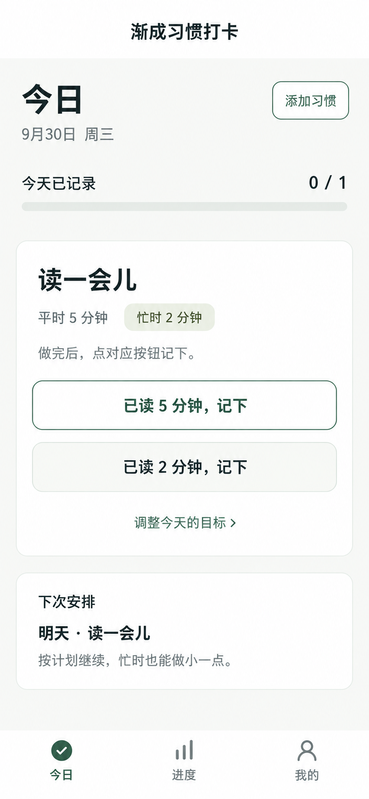
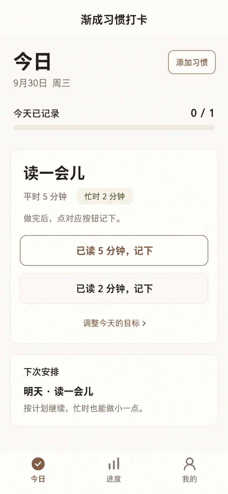

# 渐成习惯打卡：双主题与柔和配色修订

日期：2026-09-30。状态：设计方案，未实现主题切换。承接[旅程审查](UX-JOURNEY-REVIEW-20260930.md)，本稿替代其第一版配色及“只选一种视觉方向”的安排。两套主题都进入设计范围，默认使用薄雾绿。

交给实施AI时，以[具体执行规格](AI-OPTIMIZATION-HANDOFF-20260930.md)和[验收清单](AI-OPTIMIZATION-ACCEPTANCE-20260930.md)为执行入口；本稿提供视觉图及配色依据。独立开关、协议、冲突、离页与云回执处理已在交接规格中定稿。

## 1. 调整判断

第一版概念稿中，深绿标题、深绿主按钮、青柠整条次按钮与青柠完成背景同时出现，色彩占用面积偏大，多个区域争夺注意力。用户已反馈“颜色浓厚、有点扎眼”；这是一条明确的个人视觉反馈，尚不能扩展为所有用户的感受。

调整方式：

- 墨绿保留为品牌小面积标识；日常控件使用更低饱和的灰绿。
- 页面大部分由近白底与白面构成。目标是减少连续色块，不靠把文字调浅来营造柔和感。
- 青柠转为浅灰橄榄，只用于“忙时”小标签；取消整条亮青柠按钮和完成背景。
- 日常记录主按钮用清楚的描边，忙时按钮用中性色浅面与完整文字。创建/保存等唯一提交动作仍可用一块低饱和实心按钮。
- 标题用中性深灰，减少全页深绿文字；保留足够的字重与对比度。
- 去掉渐变、光泽、纸纹与明显阴影。浅色不等于低对比度。

## 2. 两个可切换主题

| 项目 | 薄雾绿（默认） | 暖纸白 |
| --- | --- | --- |
| 感受 | 接近自然光下的浅灰绿纸面，清爽安静 | 接近干净的米白纸面，略暖、少黄色 |
| 页面底 | `#F7F8F5` | `#FAF8F3` |
| 卡片底 | `#FFFFFF` | `#FFFEFA` |
| 主要文字 | `#303A34` | `#39352F` |
| 次要文字 | `#647067` | `#70695F` |
| 动作色 | `#486557` 灰绿 | `#79604F` 灰茶棕 |
| 忙时标签底/字 | `#EDF1E2` / `#536343` | `#F0F1E7` / `#606449` |
| 普通浅面 | `#F1F4EF` | `#F3F0EA` |
| 非交互分隔线 | `#E2E7DF` | `#E6E0D6` |
| 控件轮廓 | `#819086` | `#998A7D` |
| 错误 | 共用`#A33D2A`文字+`#FFF1EB`底+具体说明 | 相同语义 |

两套主题共用页面结构、系统无衬线字体、字号、间距、圆角、图标轮廓、按钮尺寸和全部交互。原“每日一页”中的宋体大日期、编号列和不同卡片结构不作为切换主题的一部分，避免切换后改变阅读顺序与肌肉记忆。暖纸白继承原方向的温暖色感。

### 使用面积与强度

- 今日/进度等常用页以近白中性区域为主，约90%以上作为视觉方向参考，不作为精确像素硬指标。
- 青柠/灰橄榄只出现在小标签；参考尺寸约78×26px，随文字自适应。它不是按钮，不要求44px高；有点击行为时必须另提供完整触控区。
- 常用任务行不出现两块相邻的大面积实心色。完成态用文字“忙时完成/原目标完成”和小图标，不铺整卡亮色。
- 同屏确有唯一提交动作时可使用动作色实心按钮；日常任务多行时统一使用描边/浅面，避免一屏多条深色横带。
- 按钮主要层级由位置、措辞、字重与轮廓共同表达，颜色仅辅助。降低填色后需要复测“第一眼能否找到记录按钮”。

## 3. 修订视觉稿

| 薄雾绿 | 暖纸白 |
| --- | --- |
|  |  |

两图为内置图像生成工具制作的同屏配色示意，均853×1844px，概念基准390×844。第二图以上一图为编辑目标，仅调整颜色。已目视核对两图的文本、5/2目标、按钮顺序和主要布局一致；未进行真实小程序像素或交互验收。

原旅程五屏的布局与文案继续参考，颜色和按钮填色规则以本稿为准。图中“下次安排”用于展示主题在辅助内容中的效果；实际显示条件沿用业务规则，不因主题切换而提前显示。原生导航/胶囊、Tab图标与安全区按微信真实组件处理。

图像生成会引入细微纹理、边界与颜色偏差；实现使用本表纯色token。次要按钮虽在图中边界较浅，交付实现时使用control-border色保证控件可识别，不机械取样生成图。

## 4. 主题切换交互

入口：**我的 → 偏好设置分组内的外观主题**，右侧显示当前主题名；分组不是另一个页面。首页不新增主题切换按钮，首次进入不强制选主题。主题能力关闭时隐藏入口，直达页面提供未开放说明。

流程：

1. 打开“外观主题”，显示薄雾绿、暖纸白两张相同内容的缩略预览。当前主题标记“使用中”。
2. 点另一张：仅本页预览颜色，显示“已选”；底部按钮“使用暖纸白”或“使用薄雾绿”。两张预览卡保持固定尺寸，选择标识同时含文字与边框。
3. 点使用：按钮显示“正在保存”，禁止重复提交；云端确认后整应用更新，并短提示“已切换为暖纸白”。保留当前页面、输入与滚动位置。
4. 未提交就返回/取消：丢弃预览，继续原主题。选中当前主题时按钮显示“正在使用”且不发重复请求。已提交后离页不能当作取消云事务；同账户合法回执仍由会话协调器处理。
5. 已知保存失败：原主题仍生效，预览保留，提供原因与重试。结果不明显示“保存结果待核对”，复用同operationId及冻结payload幂等核对，不只读某个颜色就判断旧请求结束，不生成新的写意图；冲突读取最新值后由用户再次确认。
6. 断网：可看预览；使用按钮不可提交，显示“连接网络后可保存主题”。不创建本地持久偏好或离线写队列。

首次没有偏好时默认薄雾绿；有已保存偏好时随当前微信账户读取。主题是账户外观偏好，不跟随手机自动切换；当前范围为两套浅色主题，没有暗色主题或自动定时切换。

主题应用范围包括今日、创建、详情、进度、我的、助手、设置、分享落地页的应用自绘区域，以及加载/空态/错误/完成态。系统授权弹窗、键盘等由微信与系统管理，不能承诺完全随主题换肤。生成的公开分享内容不包含用户的主题偏好字段。

## 5. 开发落地边界

主题通过语义token映射，不复制两套WXML和业务逻辑；图标形状、组件尺寸保持一致。实现需处理普通、按下、选中、禁用、加载和焦点状态，避免只替换主背景。

源码核对：当前`server/features.js`偏好patch允许`pinnedHabitId`、`reminderSlot`，客户端`services/features-client.js`也未返回theme。因此，跨会话主题保存需要补齐云端偏好协议、校验、客户端与清除/隔离约束，不能宣称“只改CSS就完成”。

字段为`theme: 'mist' | 'paper'`；旧记录缺省读为`mist`，不批量改写历史记录。沿用当前`jiancheng_daka_preferences`账户边界、revision/幂等/冲突约束；使用同features函数内独立`getAppearance/setAppearance`动作及独立主题开关，不为主题开启无关分享或提醒能力。未取得可信账户上下文前只显示默认中性浅底，不从其他账户复用主题；清除个人数据时一并处理偏好。

启动时账户就绪后去重读取主题，不阻塞习惯读取与核心页面；默认浅底先呈现，合法回执到达后无动画应用。当前会话已有合法偏好时可在内存中复用；冷启动离线无已确认偏好时使用默认/中性错误页，不缓存账户绑定或本机快照。

新主题能力先纳入OpenSpec规划，再安排代码实施；云端协议与部署仍按阶段安排。本轮仅更新设计说明和视觉稿。

## 6. 对比度与验收

以下为sRGB计算结果，未把生成图颜色当测量值：

| 组合 | 对比度约值 |
| --- | --- |
| 薄雾绿主文字/页面 | 11.06:1 |
| 薄雾绿次文字/页面 | 4.86:1 |
| 灰绿动作/白底（或白字/灰绿） | 6.41:1 |
| 薄雾绿忙时标签字/底 | 5.65:1 |
| 暖纸白主文字/页面 | 11.48:1 |
| 暖纸白次文字/页面 | 5.11:1 |
| 灰茶棕动作/白底（或白字/灰茶棕） | 5.83:1 |
| 暖纸白忙时标签字/底 | 5.40:1 |
| 两套控件轮廓/白底 | 3.35:1 / 3.34:1 |

实际浅面、按下态与焦点的所有组合仍需逐项复测；装饰分隔线不充当唯一交互边界。原报告正文16px、说明14px、按钮推荐48px/最低44px的规格继续适用。

验收任务：

- 看新版今日页，5秒内指认主要记录动作；主次目标不得因变浅而混淆。
- 同内容、同亮度展示旧稿/新版，收集刺眼感、清晰度与偏好原因；不将用户本轮个人反馈统计成群体结论。
- 在“我的”找到主题、预览、取消、应用再返回今日；切换前后按钮位置和输入保持一致。
- 重开应用能读回当前账户主题；账号切换、清除数据后不得带入上一账户偏好。
- 断网、保存失败、提交结果不明都不显示已保存，不落本地快照，不写离线队列。
- 两主题下逐页检查空态、错误、成功、长文本、320px、大字号；均满足文字可读和触控要求。

本轮已完成：两套静态视觉稿检查、token对比度计算、设计文档一致性检查。主题运行、交互原型测试、真实用户与真机验证未开展。
